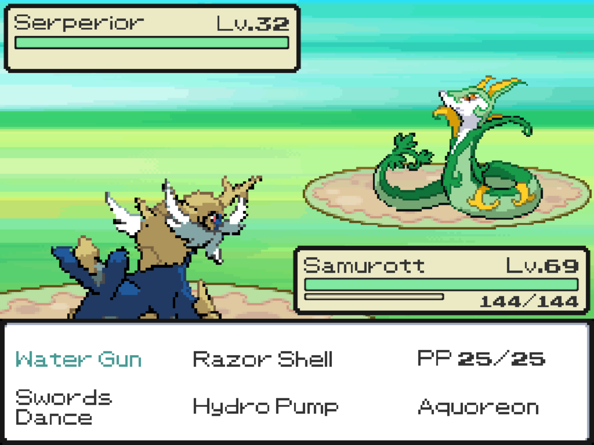
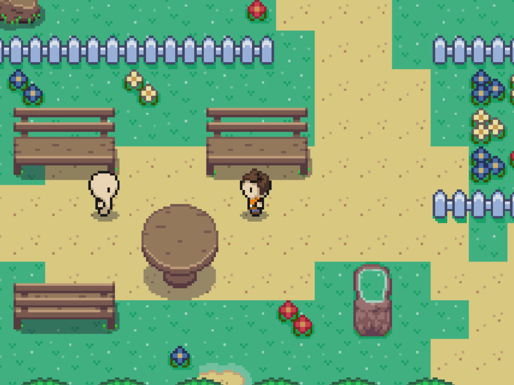
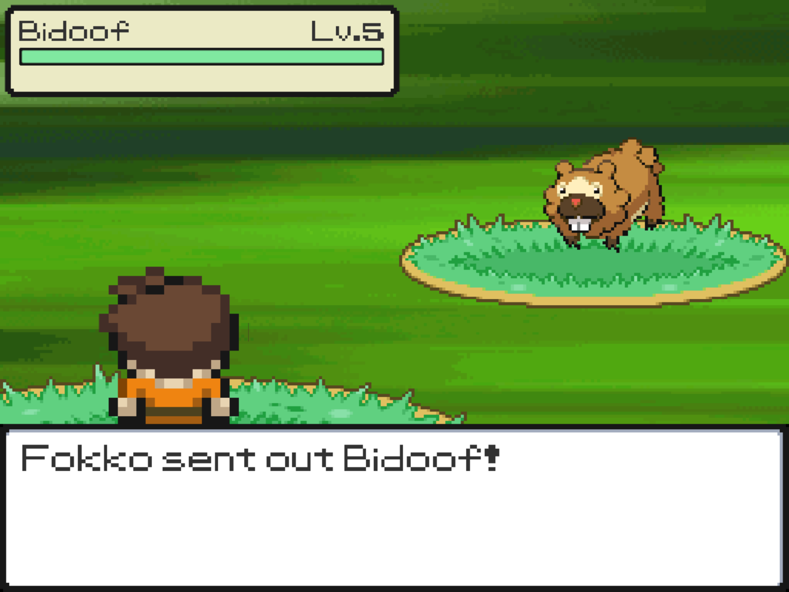
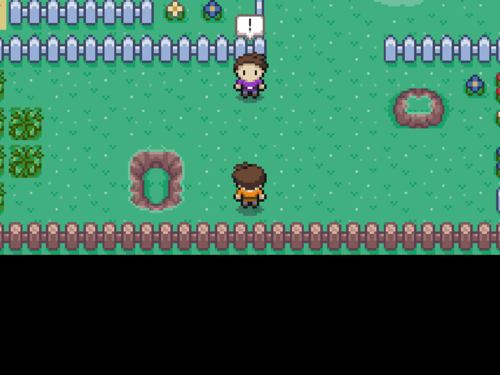
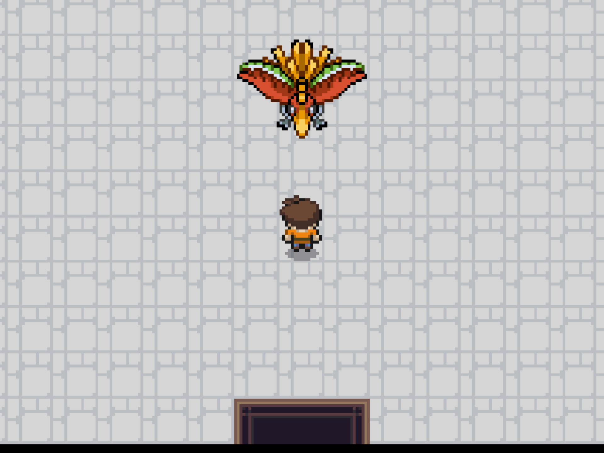
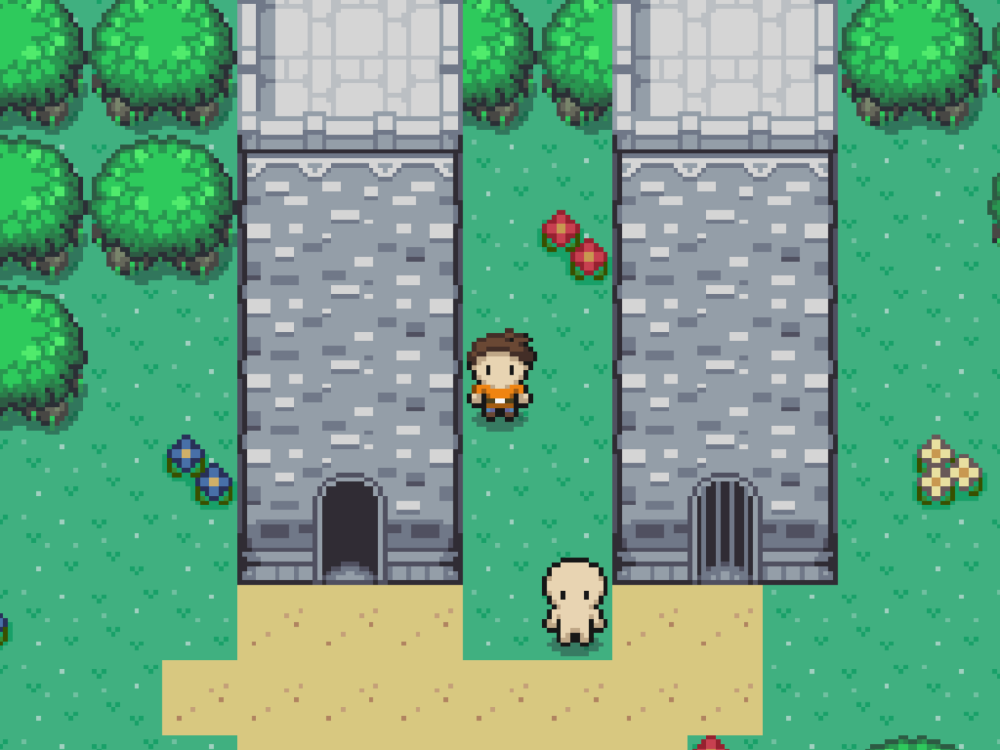
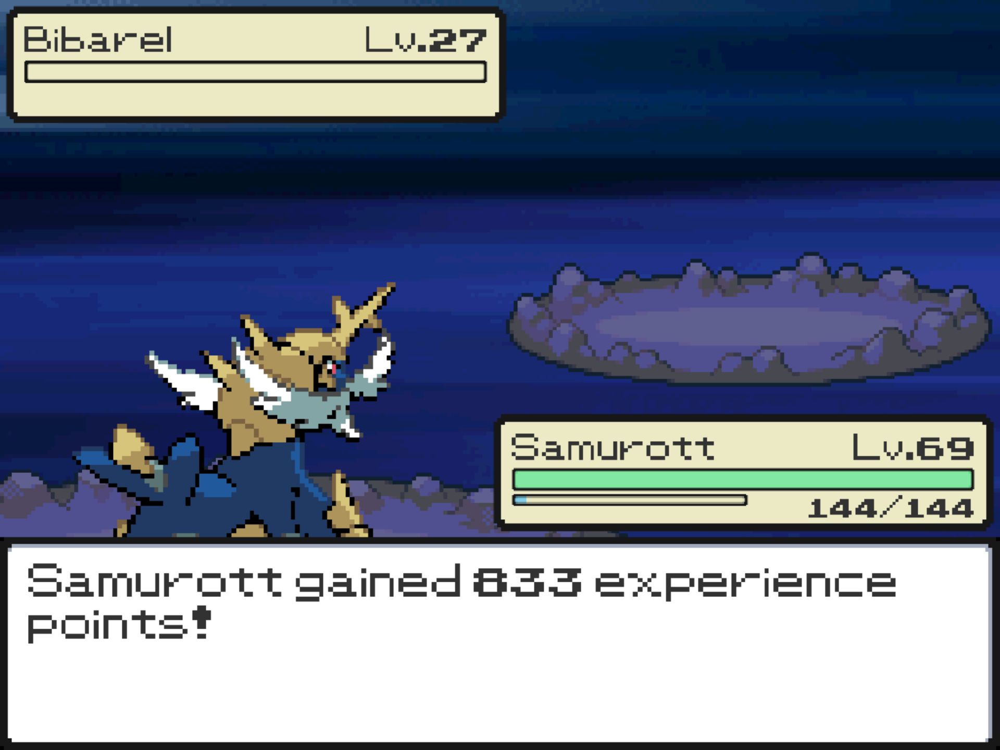
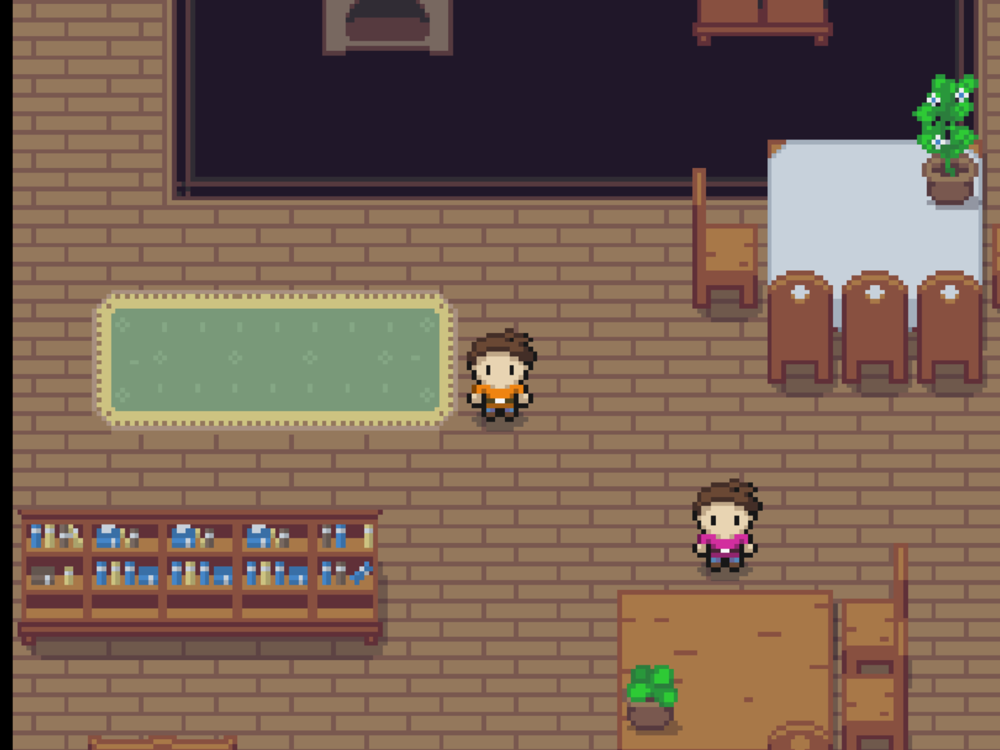

# Uniteon

## Description
Uniteon is a captivating RPG game inspired by the beloved Pokémon franchise. Embark on an extraordinary adventure in a vast and enchanting world, filled with captivating creatures, strategic battles, and a thrilling quest for unity.

|  |  |  |  |
|------------------------|------------------------|------------------------|------------------------|
|  |  |  |  |

## Origin
This game was born from a one-week coding challenge in Unity. Throughout that week, my life revolved around nothing but eating, sleeping, and coding, as I poured my heart and soul into crafting Uniteon. It was a fun ride!

## Key Features
- **World**: Uniteon employs a 2D tile-based movement style, utilizing Unity's 2D engine with multiple layers to achieve a 3D perspective within a 2D game. Explore and discover various routes, cities, and lakes that offer a rich and immersive experience.
- **Battle System**: Staying true to the renowned turn-based battle system of Pokémon, Uniteon faithfully recreates the essence of strategic combat. The game incorporates features such as switching, physical/special/status moves, leveling up, learning new moves, and even incorporates the original mathematical formulas and statistics from the Pokémon games.
- **Moves and Uniteons**: Uniteon directly inherits moves and Uniteons from the Pokémon series, making it easy to reference their power and statistics.
- **Animations**: To enhance the visual appeal and ensure a seamless experience, Uniteon implements animations in both the overworld and the battle system.
- **Music and SFX**: Uniteon features remastered Pokémon music and sound effects from the original games, providing an interactive and immersive audio experience.
- **Mentor and Overworld Battles**: Experience Mentor battles, akin to Trainer battles in Pokémon games, and encounter legendary Pokémon in the overworld, presenting opportunities for challenging encounters.
- **Storyline**: Engage with NPCs scattered throughout the world who provide guidance and direction. Your ultimate goal is to obtain the legendary Uniteon from the Ecruteak Tower and defeat the Champion by training your party Uniteons to reach their full potential.

## Issues
If you encounter any issues while playing Uniteon, please report them on the GitHub issue tracker. Provide a detailed description of the problem, including steps to reproduce it and any relevant error messages. After having done this 1-week challenge, I still have some bugs remaining I didn't have time for to fix. They are visible in the issue tracker.

## Credits
Special thanks to:
- [Zame](https://www.youtube.com/@The_Zame) - for the music
- [Buch](https://opengameart.org/users/buch) - for the Tuxemon tileset
- [ArMM1998](https://opengameart.org/users/armm1998) - for the Zelda-like tilesets and sprites
- The Pokémon Company - for their inspiration